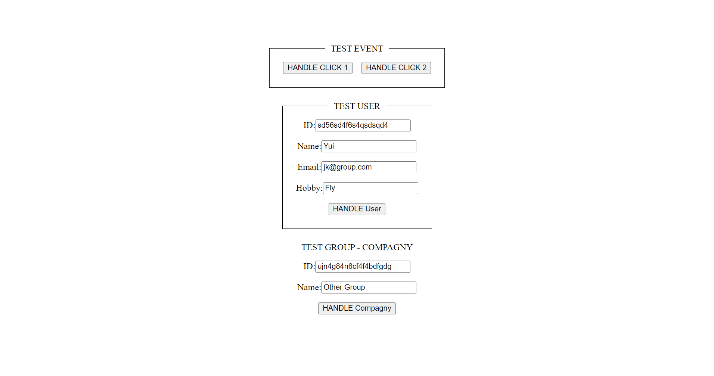
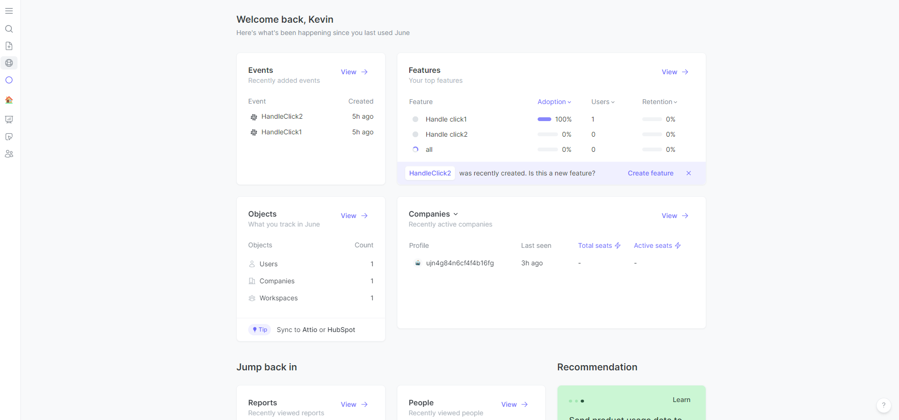
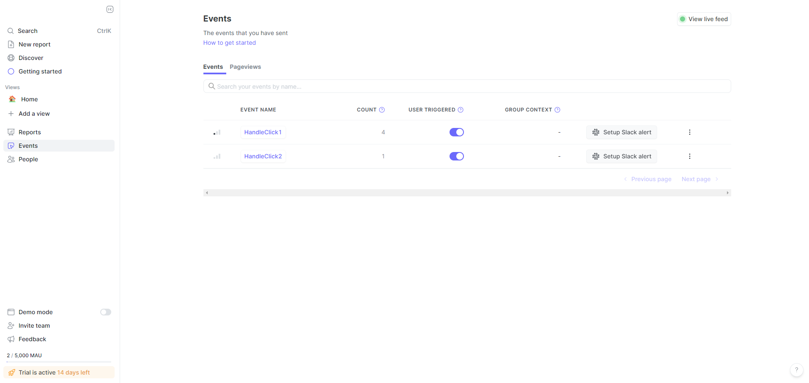
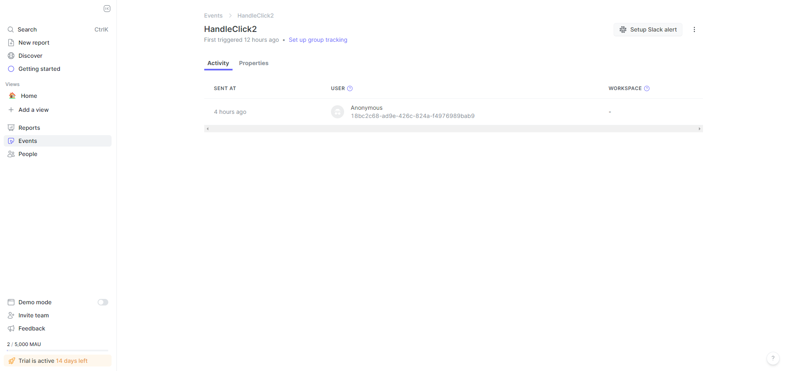
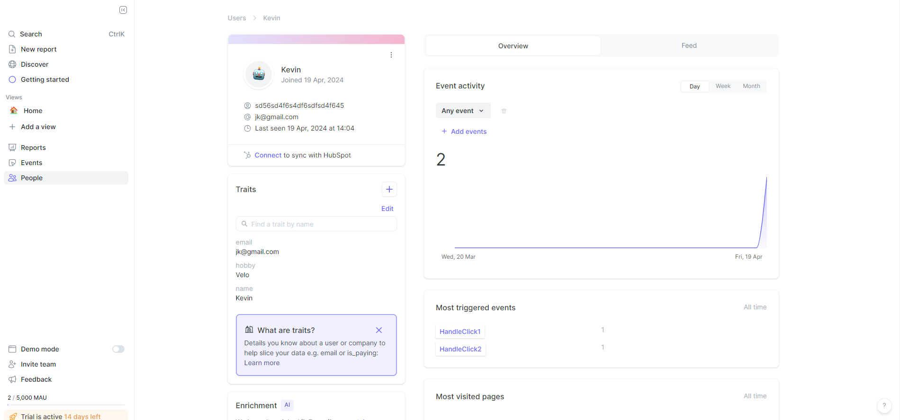
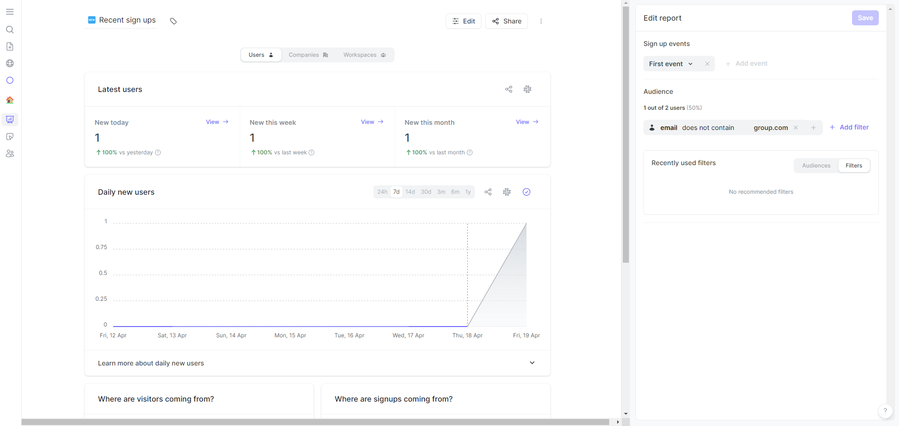

# POC-JUNE





## Goal

This project is a poc on June. June is a SaaS created to analyze product through event. June let you easy track anything happing on your frontend or backend, you can group user into group with an API quite easy to integrate to any project.
I made this poc using `Nx` to create the structure of the project, I used `React` and the `@june-so` package.
I also made a second POC to see how it's done on the backend part. I made an `express` project and the result is quite similar to the frontend version.

## Plan of the presentation

I explain with all the details how I build the project and my way of working.

- [Goal](#goal)
- [Plan of the presentation](#plan-of-the-presentation)
- [Development](#development)
- [Running](#running)
- [System](#system)
- [Links](#links)

## Development

There is two project: frontjune and backjune.
I made one project for testing to integrate June with React and another one for testing the integration with Express.

#### Setting up June

In order to setup June, you need to create an account on: [June](https://www.june.so/)
Once you go an account, you should received an key. It will be important for the following step.

```bash
# For REACT
$ npm install @june-so/analytics-next --save
# For Node
$ npm install @june-so/analytics-node --save
```

In the ``main.tsx`, load the library at soon as the app start:

```js
import { AnalyticsBrowser } from '@june-so/analytics-next';

const analytics = AnalyticsBrowser.load({
  writeKey: NODE_ENV.WRITE_KEY,
});
```

Create a hook in `hooks/useJune.ts`:

```js
import { useEffect, useState } from 'react';
import { AnalyticsBrowser } from '@june-so/analytics-next';

export function useJune() {
  const [analytics, setAnalytics] = useState<AnalyticsBrowser | undefined>(
    undefined
  );

  useEffect(() => {
    const loadAnalytics = async () => {
      const response = AnalyticsBrowser.load({
        writeKey: NODE_ENV.WRITE_KEY,
      });
      setAnalytics(response);
    };
    loadAnalytics();
  }, []);

  return analytics;
}
```

Now, the hook can be use everywhere.

#### Track an event

In order to track an event, just use the `track` function as I did in `app.tsx`

```js
import { useJune } from '../hooks/useJune';

export function App() {
  const analytics = useJune();

  const handleClick1 = () => {
    if (analytics) analytics.track('HandleClick1');
  };

  return (
    <div>
      <button onClick={handleClick1}>HANDLE CLICK 1</button>
    </div>
  );
}

export default App;
```

In [June analytics](https://analytics.june.so/), you can now see the number of time the button has been clicked:



You can check each event, if for example, I click on the second event `handleclick2`, I can see when the event has been fired and by who.  
In the following example, the user is anonymous because I have not use the identify function. I will actually do it in the next section.



It's possible to also add some extra information and add some context to an event as I did in handleclick2.

#### Identify an user

In order to identify the user, you can use the `identify` function:

```js
    analytics.identify(id, {
    email,
    name,
    hobby,
    });
```

The **id** is what make the identification possible.



#### Group the user

In order to group the user, **once they are identify**, simply use the group function:

```js
    analytics.group(id, {
    group_type: 'company',
    name,
    });
```

If no group_type has been specify, the group_type will be **workspace**.

#### Filter by email

Once the data is saved, you can get report with some filter such as on email:



## Running

In the terminal, type the following command:

```bash
## In order to launch the front poc
$ nx serve frontjune
```

## System

Ubuntu Version: Ubuntu 20.04.1
Node Version: v20.12.2
Npm Version: v10.5.2

The version are manage with [Volta](https://docs.volta.sh/guide/getting-started).

```bash
# Get the latest version of ubuntu
$ lsb_release -a

# Get the version of node
$ node -v

# Get the version of npm
$ npm -v
```

