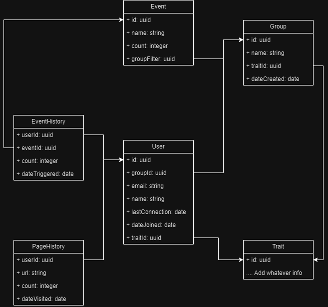

# POC-JUNE


## Goal

This project is a poc on June. June is a SaaS created to analyze product through event. June let you easy track anything happing on your frontend or backend, you can group user into group with an API quite easy to integrate to any project.
I made this poc using `Nx` to create the structure of the project, I used `React` and the `@june-so` package.
I also made a second POC to see how it's done on the backend part. I made an `express` project and the result is quite similar to the frontend version.

## Plan of the presentation

I explain with all the details how I build the project and my way of working.

- [Goal](#goal)
- [Plan of the presentation](#plan-of-the-presentation)
- [Development](#development)
- [Running](#running)
- [System](#system)
- [Links](#links)

## Development

There is two project: frontjune and backjune.
I made one project for testing to integrate June with React and another one for testing the integration with Express.

#### Setting up June

In order to setup June, you need to create an account on: [June](https://www.june.so/)
Once you go an account, you should received an key. It will be important for the following step.

```bash
# For REACT
$ npm install @june-so/analytics-next --save
# For Node
$ npm install @june-so/analytics-node --save
```

In the ``main.tsx`, load the library at soon as the app start:

```js
import { AnalyticsBrowser } from '@june-so/analytics-next';

const analytics = AnalyticsBrowser.load({
  writeKey: NODE_ENV.WRITE_KEY,
});
```

Create a hook in `hooks/useJune.ts`:

```js
import { useEffect, useState } from 'react';
import { AnalyticsBrowser } from '@june-so/analytics-next';

export function useJune() {
  const [analytics, setAnalytics] = useState<AnalyticsBrowser | undefined>(
    undefined
  );

  useEffect(() => {
    const loadAnalytics = async () => {
      const response = AnalyticsBrowser.load({
        writeKey: NODE_ENV.WRITE_KEY,
      });
      setAnalytics(response);
    };
    loadAnalytics();
  }, []);

  return analytics;
}
```

Now, the hook can be use everywhere.

#### Track an event

In order to track an event, just use the `track` function as I did in `app.tsx`

```js
import { useJune } from '../hooks/useJune';

export function App() {
  const analytics = useJune();

  const handleClick1 = () => {
    if (analytics) analytics.track('HandleClick1');
  };

  return (
    <div>
      <button onClick={handleClick1}>HANDLE CLICK 1</button>
    </div>
  );
}

export default App;
```

In [June analytics](https://analytics.june.so/), you can now see the number of time the button has been clicked:


You can check each event, if for example, I click on the second event `handleclick2`, I can see when the event has been fired and by who.  
In the following example, the user is anonymous because I have not use the identify function. I will actually do it in the next section.


It's possible to also add some extra information and add some context to an event as I did in handleclick2.

#### Identify an user

In order to identify the user, you can use the `identify` function:

```js
    analytics.identify(id, {
    email,
    name,
    hobby,
    });
```

The **id** is what make the identification possible.


#### Group the user

In order to group the user, **once they are identify**, simply use the group function:

```js
    analytics.group(id, {
    group_type: 'company',
    name,
    });
```

If no group_type has been specify, the group_type will be **workspace**.

#### Filter by email

Once the data is saved, you can get report with some filter such as on email:


## How does it work?

#### Segment

By looking in the library of June, I discovered that they are using the track library Segment from twilio for the node version one.
June simply created an endpoint to received the result on https://api.june.so/sdk/batch.
This is quite clever since they are in this case not really wasting resources on the library to keep up with the evolution of node.
But at the same time, they are heavily relaying on another compagny to generously shared their library.

So if I want to reduce a bit the size of my node_module, I can directly use the segment library instead of embedding it. However, it requires to pay attention to the evolution of their library in case for example, their change their endpoint.

```js
import { Analytics as BaseAnalytics } from '@segment/analytics-node';

const analyticsSegment = new BaseAnalytics({
  writeKey,
  host: 'https://api.june.so',
  path: '/sdk/batch',
});
```

And from here, I can use the library the same way as it described in the documentation.

```js
  analyticsSegment.identify({
    userId: id,
    traits: {
      email: email,
      name: name,
    },
  });
```

The logic is quite the same for the front version but instead of using the `@segment/analytics-node`, they are using the `@segment/analytics-next`.

#### Queue

By testing multiple thing, I notice there is delay between the moment I track an event on the application.  
I suspect them to use a queue to be able to handle everything on a single endpoint. I try to flood it a bit but everything get tracked as it should be.
It's logic to have such a queue and certainly a dead queue at this point but I wanted to point it out.  
Multiple time during my test I wondered if my event was really tracked or not as  sometime I waited 5min before it shows up on their client.

#### Model

This part is only hypothetical in case I want to reproduce their analytical product for my own project.  
I dont think it's too complexe. Their website has a lot of functionnality but most of them are not necessary for a developper.  
From a database, a developper can extract whatever filtered information he want easily from a query. 
Going around, if I have to make such a product, I will certainly design the database this way:



June has another level on top of group which is workspace. But in my own product, I dont really that level of separation.

#### Third Party Connection

June also has multi connection to third party such as Slack to make some alert on event and Hubspot to scrap some information or send email.

## Running

In the terminal, type the following command:

```bash
## In order to launch the front poc
$ nx serve frontjune
```

## System

Ubuntu Version: Ubuntu 20.04.1
Node Version: v20.12.2
Npm Version: v10.5.2

The version are manage with [Volta](https://docs.volta.sh/guide/getting-started).

```bash
# Get the latest version of ubuntu
$ lsb_release -a

# Get the version of node
$ node -v

# Get the version of npm
$ npm -v
```

